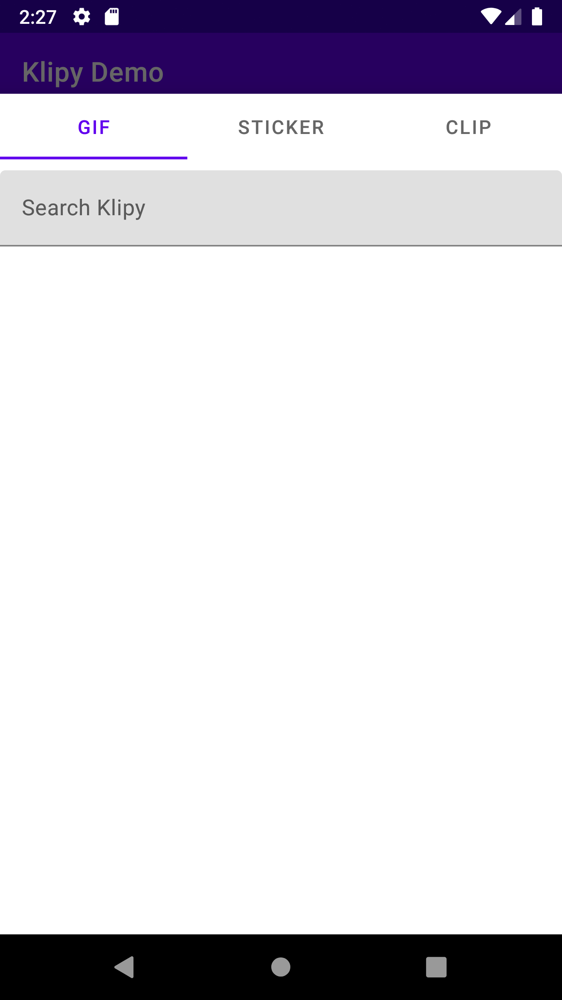
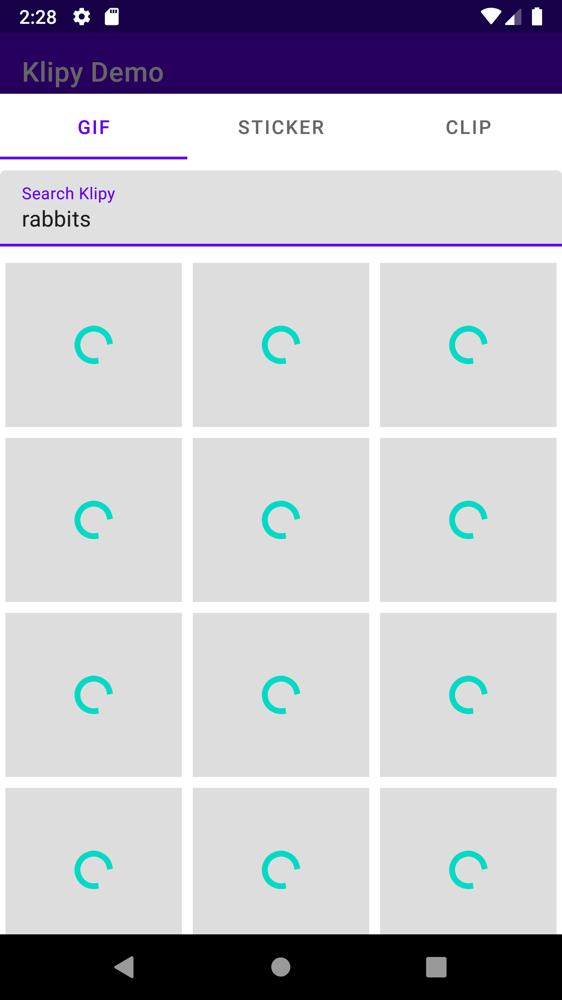
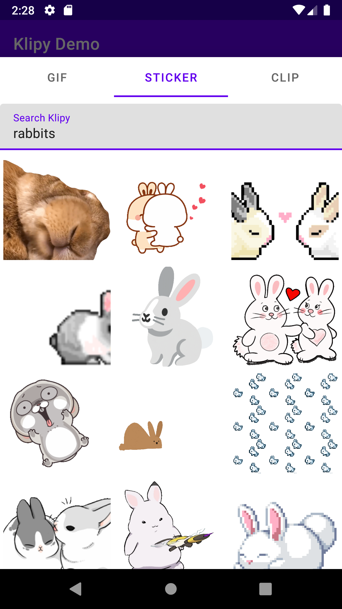
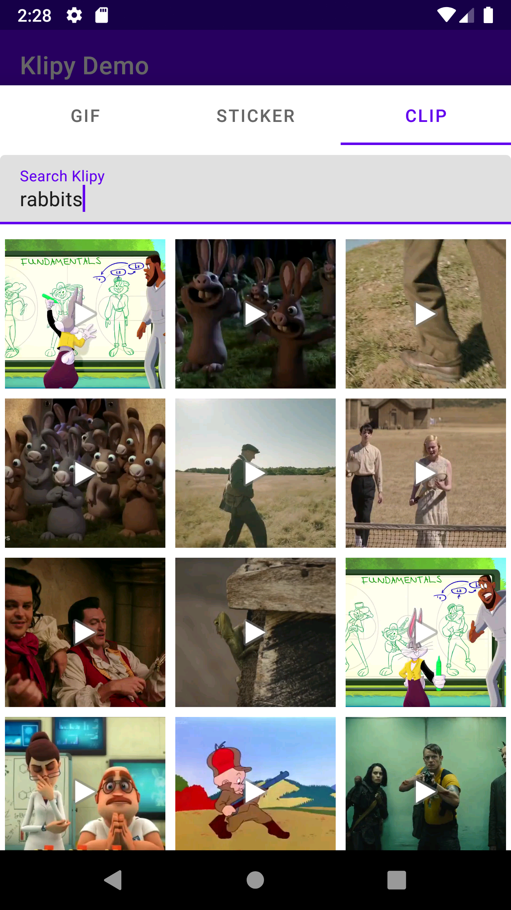
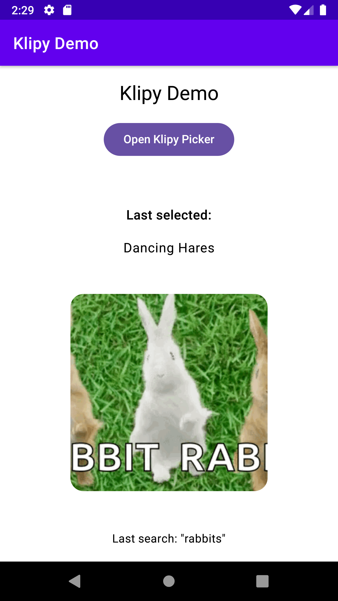
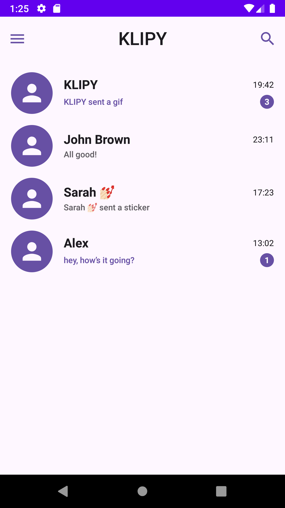
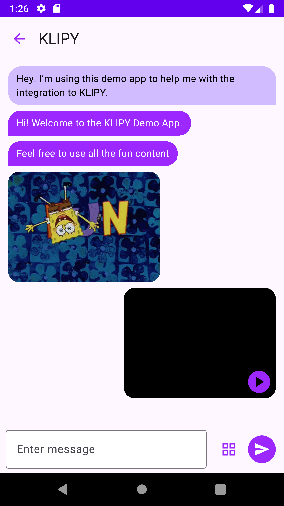

# Klipy Android SDK

[](https://github.com/Cortlandd/klipy-android-sdk/blob/master/LICENSE.md)

An Android SDK wrapping the [Klipy](https://klipy.com) API to drop a GIF, Sticker, Clip, or Meme into your Android app with a single SDK.

---

## Modern Android Stack

The SDK and sample app are built using current Android patterns and libraries:

- **Modular SDK**
    - `klipy`: core networking + data models (Kotlin, coroutines, Flow).
    - `klipy-ui`: optional UI module providing a ready-made picker dialog (BottomSheetDialogFragment, RecyclerView, Glide).
    - `demo`: A sample chat app that makes use of KlipyTray to get images from keyboard.
    - `app`: A sample to showcase the KlipyPickerDialogFragment to allow Klipy search with 1 button.

- **Sample App Features**
    - **Single-Activity / Nav Graph** using **Jetpack Navigation** for screen flow.
    - **Fragment-based UI** (e.g., `HomeFragment`) hosting:
        - A **Compose** `HomeScreen` via `ComposeView`.
        - The **Klipy picker** as a `BottomSheetDialogFragment`.
    - **Jetpack Compose** for the home screen and selections:
        - Uses `@Composable` UI for the demo screen.
        - Integrates SDK results back into Compose via `AndroidView`.
    - **Coroutines + Flow**:
        - `viewModelScope`, `suspend` functions, and `Result` wrapping for network calls.
        - `StateFlow` to drive UI state from ViewModels.
    - **Glide 5** for image & GIF rendering and thumbnailing (GIFs, stickers, mp4 clips).
    - **Paging-like UX** in the picker:
        - Infinite scroll on RecyclerView to load additional pages.
    - **Material Components**:
        - Uses Material 3 in the Compose demo screen.
        - Uses Material bottom sheet for the picker UI.
    - **State management**:
        - `klipy-ui` tray/picker uses only AndroidX ViewModel + StateFlow (no external architecture dependency).
        - `demo` may include additional helper abstractions for experimentation.

You can use the SDK in:
- Pure XML / Fragment apps.
- Compose-first apps (by hosting Fragment or Dialog via `AndroidView` or regular fragment transactions).

---

## Installation

1. Add the JitPack repository to your project:
```kotlin
// settings.gradle.kts
dependencyResolutionManagement {
   repositories {
       google()
       mavenCentral()
       maven("https://jitpack.io")
   }
}
```

2. Add the dependency with latest version:
```kotlin
// app/build.gradle.kts
dependencies {
    implementation("com.github.Cortlandd:klipy-android-sdk:klipy:0.1.4")
    // If you want to use the picker fragment, the above isn't necessary to implement as ui uses it arleady
    implementation("com.github.Cortlandd:klipy-android-sdk:klipy-ui:0.1.4")
}
```
Or
```kotlin
dependencies {
    // Core SDK
    implementation(project(":klipy"))

    // Optional UI layer: picker dialog, adapter, etc.
    implementation(project(":klipy-ui"))
}
```

## Basic Sample App Module Screenshots
| Default State        | Search Screen          | Gif Results            | Sticker Results        | Clip Results           | Displaying selection   |
|----------------------|------------------------|------------------------|------------------------|------------------------|------------------------|
|  |  |  |  |  |  |

| Sample Video                              |
|-------------------------------------------|
|  |

## Basic Sample Demo Module Screenshots

| Default chat list         | Display conversation        | Tapping the grid icon opens KlipyTray | Gif selection displaying in conversation | Show preview of selection   |
|---------------------------|-----------------------------|---------------------------------------|------------------------------------------|-----------------------------|
|  |  |            |               |  |

## Quick Start

1. Option 1: Configure once (recommended if you're already using the core SDK)
```kotlin
class App : Application() {
    override fun onCreate() {
        super.onCreate()
        val repo = KlipySdk.create(
            context = this,
            secretKey = "KLIPY_API_KEY",
            enableLogging = true
        )

        KlipyUi.configure(repo)
    }
}
```

2. Show the picker in a Fragment (works with Option 1 above, or the picker-only setup below)
```kotlin
class ChatFragment : Fragment(R.layout.fragment_chat), KlipyPickerListener {

    private fun openKlipyPicker() {
        val config = KlipyPickerConfig(
            mediaTypes = listOf(MediaType.GIF, MediaType.STICKER, MediaType.CLIP),
            columns = 3,
            showRecents = true,
            showTrending = true,
            initialMediaType = MediaType.GIF
        )

        val dialog = KlipyPickerDialogFragment.newInstance(config).apply {
            listener = this@ChatFragment
        }

        dialog.show(childFragmentManager, "klipy_picker")
    }

    override fun onMediaSelected(item: MediaItem, searchTerm: String?) {
        // Send the selected item in your chat:
        // - item.mediaType (GIF/STICKER/CLIP/AD)
        // - item.lowQualityMetaData / highQualityMetaData
        // - filter out ads with item.isAD()
    }

    override fun onDismissed(lastContentType: MediaType?) {
        // Optional: do something when the sheet is dismissed
    }

    override fun didSearchTerm(term: String) {
        // Optional: observe search terms
    }
}
```

If you don't want to configure `KlipyUi` globally, you can also open the picker by passing your API key directly.

### Alternative: show the picker without global configuration (GIPHY-style)

If you don't want to call `KlipyUi.configure(repo)` in your `Application`, you can pass your
Klipy API key directly to the picker fragment:

```kotlin
val dialog = KlipyPickerDialogFragment.newInstance(
    config = config,
    secretKey = "KLIPY_API_KEY",
    enableLogging = true
).apply {
    listener = this@ChatFragment
}

dialog.show(childFragmentManager, "klipy_picker")
```

3. Rendering media
   You decide how to render the MediaItem:
```kotlin
Glide.with(imageView)
    .asGif()
    .load(item.highQualityMetaData?.url ?: item.lowQualityMetaData?.url)
    .into(imageView)
```

# Using the UI Picker (klipy-ui)
klipy-ui ships a ready-made picker similar in spirit to Giphy’s dialog:
- Implemented as a BottomSheetDialogFragment.
- Supports GIFs, stickers, and clips (mp4).
- Search-on-submit (no auto-search on open).
- Infinite scroll / paging via RecyclerView.
- Not tied to Compose – works in any Fragment-based app.

Typical usage from a Fragment:
```kotlin
private fun openKlipyPicker() {
    val config = KlipyPickerConfig(
        columns = 3,
        showRecents = true,
        showTrending = true
    )

    val dialog = KlipyPickerDialogFragment.newInstance(config)
    dialog.listener = object : KlipyPickerListener {

        override fun onMediaSelected(item: MediaItem, searchTerm: String?) {
            // Handle selection (GIF, sticker, or clip)
        }

        override fun onDismissed(lastContentType: MediaType?) {
            // Optional: handle dismiss
        }

        override fun didSearchTerm(term: String) {
            // Optional: observe terms being searched
        }
    }

    dialog.show(childFragmentManager, "klipy_picker")
}
```

You can then render the selected MediaItem however you like (e.g., Glide for GIFs/stickers, VideoView/ExoPlayer for clips, or Compose wrappers in your own app).

---

# API Surface (1.0)
### Public core types:
- com.klipy.sdk.KlipySdk
- com.klipy.sdk.KlipyRepository
- com.klipy.sdk.model.MediaType
- com.klipy.sdk.model.MediaItem
- com.klipy.sdk.model.Category
- com.klipy.sdk.model.MediaData
- fun MediaType.singularName()
- fun MediaItem.isAD()
### Public UI types:
- com.klipy.klipy_ui.KlipyUi
- com.klipy.klipy_ui.KlipyPickerConfig
- com.klipy.klipy_ui.KlipyPickerDialogFragment
- com.klipy.klipy_ui.KlipyPickerListener
  Everything under com.klipy.sdk.data and KlipyMediaAdapter is internal implementation detail.

---

You find an issue, open an issue

# FAQ
Q: Do I have to use the UI module?
A: No. You can use `KlipySdk.create(...)` + `KlipyRepository` directly and build a custom UI on top of `MediaItem`.

Q: Gonna do ios also?
A: Probably.